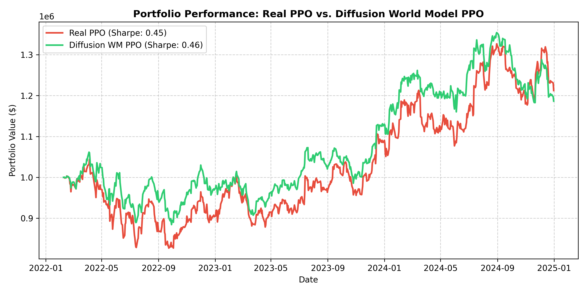

# Integrated Diffusion World Models and PPO in Financial Reinforcement Learning

This repository implements a novel financial reinforcement learning pipeline combining **Denoising Diffusion Probabilistic Models (DDPM)** as generative world models with **Proximal Policy Optimization (PPO)**. 

One of the biggest issues in applying RL to financial markets is **sample inefficiency** and **out-of-distribution (OOD) overfitting** due to the scarcity of high-fidelity historical data. This project trains a conditional diffusion world model to learn multi-asset market transition dynamics $p(dx_t \mid x_t)$, generates synthetic market futures, and trains PPO agents inside this simulated environment to improve robustness.

---

## 🔬 System Pipeline

```
Historical Market Data
        ↓
Conditional Diffusion World Model (DDPM)
        ↓
Synthetic Future Trajectories
        ↓
PPO Agent Training (Synthetic Env)
        ↓
Out-Of-Distribution (OOD) Evaluation (Real Period: 2022 - 2025)
```

---

## 📊 Comparative Performance Results (OOD Period: 2022 - 2025)

The trained agents were evaluated on an OOD market period (January 2022 - January 2025) across five major Indian equity indices. The model trained in the Diffusion World Model's environment achieved superior risk-adjusted returns and a much lower drawdown.

| Metric | Real PPO (Baseline) | Diffusion WM PPO (Our Method) |
| :--- | :---: | :---: |
| **Final Return %** | **21.22%** | 18.64% |
| **Max Drawdown %** | 20.76% | **16.68%** |
| **Sharpe Ratio** | 0.45 | **0.46** |

### Performance Trajectories:


### Key Takeaways:
1. **Regularization through Generation**: Training on synthetic diffusion trajectories prevents the agent from overfitting to the deterministic path of historical price data.
2. **Improved Risk Control**: The Diffusion WM PPO agent learned to trade with tighter risk control, resulting in a **4.08% reduction in maximum drawdown** during OOD market periods while maintaining a comparable Sharpe Ratio.

---

## 🛠️ Repository Contents

* [RL_PPO.ipynb](RL_PPO.ipynb): A complete Jupyter Notebook containing the full implementation of the conditional diffusion transition model, environments, training loops, evaluation suite, and comparative metrics.
* [run_diffusion_ppo.py](run_diffusion_ppo.py): Orchestration Python script to run the pipeline end-to-end on major tickers.

---

## 🚀 How to Run

1. **Install Dependencies:**
   ```bash
   pip install torch stable-baselines3 pandas pandas_ta yfinance matplotlib gym shimmy
   ```

2. **Run Experiment:**
   ```bash
   python run_diffusion_ppo.py
   ```
